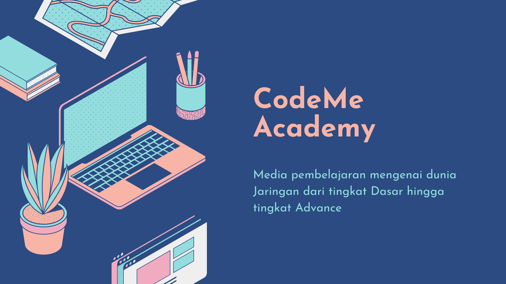

    

# Tentang CodeMe
CodeMe dibangun oleh kumpulan para pemuda yang memilki minat belajar di dunia Jaringan. Alasan CodeMe dibangun untuk mengenalkan dunia Jaringan dari tingkat Dasar hingga Advance. Organisasi ini bersifat open source, siapa saja bisa kontribusi dan bergabung ke organisasi ini.
  Materi yang akan disampaikan untuk saat ini mengenai Infrastruktur Jaringan dan Administrasi Jaringan. Selain itu akan dibahas juga beberapa bahasa pemograman yang sering digunakan dan Keamanan Jaringan. Have Fun and Enjoy to learning.

